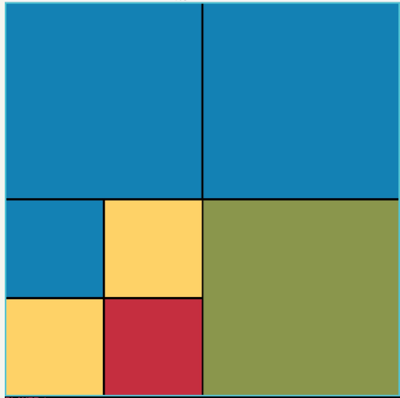
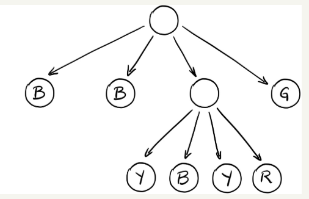

# Assignment 3 Grid Game

Due: March 14, 2022 12 NOON

Youtube Demo:
https://youtu.be/z42XU_OSb2s

Jar file: `jar/BlocklyGame-OUT.jar`
run the jar with `java -jar BlocklyGame-OUT.jar` (or maybe double click the file depending on your OS)

To run your assignment run the main method in frontend.DriverGUI.java

In this assignment you will code the back-end for a grid style game. You are given starter code in this repository. The front and middle sections of the game are provided for you.

The backend should be implemented as a QuadTree - that is a tree in which each node has 0 or 4 children. The children will each have a color and this will correspond to a location on the screen.

Example:
```ascii
           __  Root  __
         /    |    |   \
        NW    NE   SW   SE
                / |  | \
              NW  NE SW SE
```

At the base level of the game is the root (level 1) this occupies the whole screen. As you can see the root has 4 children: nw, ne, sw, se. These are all at level 2, but then we also notice the sw child of the root also has 4 children. The sw has nw, ne, sw, and se children.

See below the above example with colors:

Flattened Tree:



Quad Tree drawing of the same tree:



In the game you'll have to keep track of the current cursor position (a yellow highlight around the block representing the block that actions may be taken on).

You are provided a helper record called DrawableBlock which gives the minimum set of required attributes you must keep track of for a square in the game board to be rendered by the GUI.

You'll need to provide the x,y position, the size, whether the square is visible, whether it is selected along with the block's color.

All of your code should go into the Tree class - you'll implement all of the public methods. You may add other classes and helper methods to make your job easier.

You should not alter the other existing classes and you shouldn't alter the method headers for those public methods in the Tree class.


## Deliverables:

You may work with a partner on this assignment.

Your solution should contain all the functionality outlined in the Youtube explanation and match the game play of the same game you are provided.

Your code should be well designed and readable.

Grading:

|Delverable|Value|
|---|---|
|Code Readability| 2 |
|Code Design | 2 |
|Functionality| 6 |


Code Readability:

- naming conventions follow our guidelines
- name choices aid readability
- comments at the top of every method and class
  - lists parameters
  - return types
  - exceptions
  - what the method does and expects

Code Design:

- can the grader determine the algorithms or purpose of the code
- is the code organized
- are methods used properly
- are class instance variables appropriate
- are method variables appropriate

Functionality:

- does the game play?
  - smash, rotate, swap and merge
  - can the cursor navigate the blocks
  - does the scoring function properly

A limited amount of unit-tests are provided. However the functional aspects of your grade will mostly be determined by the grader.
